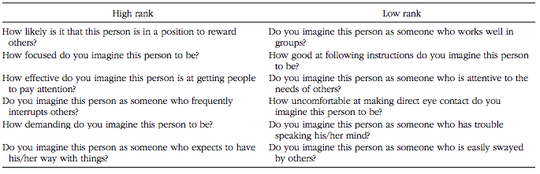

# REPLICATION REPORT


### Replication of The Sound of Power: Conveying and Detecting Hierarchical Rank Through Voice by Ko et al. (2015, Psychological Science)

Justin Salloum

jsalloum@stanford.edu


## Introduction

The present study replicates Experiment 2 from the original research, which assesses whether perceivers use speakers' hierarchy-induced acoustic cues to make hierarchical inferences about speakers. The researchers found that "perceivers used higher pitch, greater loudness, and greater loudness variability to make accurate inferences of speakers' hierarchical rank, demonstrating that acoustic cues are systematically used to detect hierarchy." Of particular interest is the result that "speakers who had been in the high-rank condition — regardless of their sex — were rated as more likely to engage in high-rank behaviors than were those in the low-rank condition."


##Methods

### Power Analysis

Original effect size $\eta^2$ = 0.603, $f^2$ = 0.572. The effect size was determined using the F-statistic and the between- and within-subject degrees of freedom.

$df_1 = 1$

$df_2 = 55$

$F(1, 55) = 83.67$

$\eta^2 = \frac{df_1F}{df_1F + df_2} = 0.603$

$f^2 = \frac{\eta^2}{1 - \eta^2} = 0.572$

Power analysis was done using the software G*Power. To detect an effect size of 0.603, the following samples sizes are needed to achieve various power:
	
Power |Sample Size Needed
------|-------------------
0.8   | 17
0.9   | 21
0.95  | 25

All of these sample sizes are reasonable and financially feasible. Note that here the sample size used in data analysis actually corresponded to the number of stimuli (speakers) rather than the number of participants in the experiment, since all the scores for each speaker were averaged over all the participants in the original research.

### Planned Sample

Just like in the original study, 40 undergraduates will be randomly selected for the sample, without restriction on age, gender or demographics. However, as a result of our power analysis, each participant will listen to only 24 speakers (25 was the necessary sample size calculated, but it must be an even number to ensure equal respresentation between speaker sex), as opposed to 60 which is the number of speakers in the original research.

### Materials

Recording of speakers saying aloud the Negotiation Passage: "I'm glad that we are able to meet today and I am looking forward to our negotiation. I know that you and I have different perspectives on some of the key issues and that these differences would need to be resolved for us to come to an agreement."

"The voices’ baseline acoustics served as the criterion for the subset of voices such that the
chosen voices’ baseline values had a smaller average deviation from the mean of their respective
sex’s baseline values."

The following items are used to measure hierarchy-based behavioral influences:


### Procedure

"Each perceiver listened to a subset of recordings of the Negotiation Passage from Experiment 1 (12 female and 12 male voices). After each recording, perceivers rated the speaker on 12 hierarchy-based behaviors plausible in a negotiation context, using a scale from 1 (not at all) to 7  (very much). Six of these behaviors were associated with high rank, and six with low rank. The order of the speakers and the order of the behaviors were randomized for each perceiver. The low-rank behaviors were reverse-scored, and then scores for all 12 behaviors were averaged to create one composite hierarchical-inference score per perceiver per speaker. 

The original procedure is followed exactly, with the exception that Experiment 1 isn't actually carried out - it is just used as a reference in the original research to obtain the recordings of the speakers.

### Analysis Plan
The data will be analyzed with the same approach as in the original research. Effect of condition on hierarchy-based behavioral inferences:

"We examined the extent to which perceivers' hierarchical inferences were consistent with the speakers' hierarchical rank using a 2 (speaker's condition: high rank, low rank) × 2 (speaker's sex: male, female) analysis of variance."

Like in the original research, the current research will look for a main effect of speaker's condition, as well as main effect of speaker sex and interaction effects between speaker condition and sex.

### Differences from Original Study

The biggest difference from the original study is the number of speakers that each participant listens to. In the original study each participant listened to and made inferences about 60 speakers, whereas in this study the number of speakers is reduced to 24. Another key difference is that answering the 12 questions about hierarchy-based behavior is the only inferential task that participants perform in this study. The third difference between the current study and the original study is the setting; the current study will be entirely online and distributed via Amazon Mechanical Turk.

## Pilot Analysis

### Initializtion and Setup

Loading the libaries needed for data analysis.

```{r}
options(warn=-1)

rm(list=ls())
library(tidyr)
library(dplyr)
library(ggplot2)
library(rjson)
library(tidyjson)
library(lme4)
library(lmerTest)
library(gridExtra)

sem <- function(x) {sd(x, na.rm=TRUE) / sqrt(length(x))}
ci95 <- function(x) {sem(x) * 1.96}
```

#### Data Reading

Data is read from the various json files into a data frame in long form.

```{r}
wid = 1
files = dir(paste0("./","production-results/"), pattern = "*.json")
d.raw = data.frame()
for (f in files) {
  jf = paste0("./", "production-results/",f)
  jd = fromJSON(paste(readLines(jf), collapse=""))
  for (elem in jd$answers$data) {
    id = data.frame(workerId = as.factor(wid),
                    speakerId = elem$speakerId,
                    speakerSex = elem$sex,
                    plev = elem$plev,
                    behaviorScore = elem$behaviorScore)
    d.raw = bind_rows(d.raw, id)
  }
  wid = wid + 1
}
```

The original data is simply read in from the csv provided on OSF.

```{r}
d = read.csv('S2_voice_level_Final.csv')
```

#### Data Preparation for Analysis

To prepare the data for analysis, speakerSex and plev are recoded as ['Male', 'Female'] and ['Low-rank', 'High-rank'], respectively. Two sets of analysis will be carried out:

1. Analysis on the data aggregated by average behavior score (d.af), in order to replicate the analysis done in the original research. To draw comparison to the original results, plots will also be generated for the original data (d.of).
2. Analysis on the raw data in long form (d.raw and d.rawf). Mixed model analysis will be conducted to see if there are any random effects of other variables such as speaker id or worker id.

```{r}
# d.af is the aggregated replication data with speakerSex and plev coded as factors, d.of is the original aggregated data with speakerSex and plev coded as factors. d.af.summ and d.of.summ represent the summary statistics for d.af and d.of respectively (mean, sem and ci)

d.af = d.raw %>% 
  mutate(
    speakerSex = ifelse(speakerSex == -1, "Male", "Female"),
    plev = ifelse(plev == -1, "Low", "High")
  ) %>%
  group_by(speakerId, speakerSex, plev) %>%
  summarise(behaviorScore = mean(behaviorScore))

d.af.summ = d.raw %>%
  mutate(
    speakerSex = ifelse(speakerSex == -1, "Male", "Female"),
    plev = ifelse(plev == -1, "Low", "High")
  ) %>%
  group_by(plev, speakerSex) %>%
  summarize(
    mean = mean(behaviorScore),
    sem =sem(behaviorScore), 
    ci95 = ci95(behaviorScore)
  )

d.of = d %>%
  mutate(
    speakerSex = ifelse(vsex == -1, "Male", "Female"),
    plev = ifelse(plev == -1, "Low", "High"),
    speakerId = voice, 
    behaviorScore = newpster
  ) %>%
  group_by(speakerId, speakerSex, plev) %>%
  summarise(behaviorScore = mean(behaviorScore))

d.of.summ = d %>%
  mutate(
    speakerSex = ifelse(vsex == -1, "Male", "Female"),
    plev = ifelse(plev == -1, "Low", "High"),
    speakerId = voice, 
    behaviorScore = newpster
  ) %>%
  group_by(plev, speakerSex) %>%
  summarize(
    mean = mean(behaviorScore),
    sem = sem(behaviorScore), 
    ci95 = ci95(behaviorScore)
  )

# d.raw is the raw data with speakerSex and plev as numeric, while d.rawf codes speakerSex and plev as factors

d.rawf = d.raw %>% 
  mutate(
    speakerSex = ifelse(speakerSex == -1, "Male", "Female"),
    plev = ifelse(plev == -1, "Low", "High")
  )

d.raw = d.raw %>% 
  mutate(
    speakerSex = ifelse(speakerSex == -1, 0, 1),
    plev = ifelse(plev == -1, 0, 1)
  )
```

Now that the data has been prepared, here's a quick look at the summary statistics of our data that we will analyze:

```{r}
# Replication data
print(d.af.summ)

# Original data
print(d.of.summ)
```

### 1. Replication of Original Analysis

#### Box Plots

We will gather an idea of the distribution of behavior scores in relation to hierarchy condition and speaker sex, and compare with the original results.

```{r}
bx1 = ggplot(d.of, aes(x = plev, y = behaviorScore, fill = speakerSex)) +
  geom_boxplot() +
  labs(title = 'Original Results', x = 'Hierarchy Condition', y = 'Behavior Score') +
  scale_fill_discrete(name = 'Speaker Sex')
bx2 = ggplot(d.af, aes(x = plev, y = behaviorScore, fill = speakerSex)) +
  geom_boxplot() +
  labs(title = 'Replication Results', x = 'Hierarchy Condition', y = 'Behavior Score') +
  scale_fill_discrete(name = 'Speaker Sex')

grid.arrange(bx1, bx2, ncol = 2)
```

#### Bar Plots

We will use bar plots to get an idea of the average behavior scores between hierarchy condition and speaker sex, and compare with the original results.

```{r}
bp1 = ggplot(d.of.summ, aes(x = plev, y = mean, fill = speakerSex)) +
  geom_bar(position = 'dodge', stat = 'identity') +
  geom_errorbar(aes(ymin = mean - ci95, ymax = mean + ci95), position = 'dodge') +
  labs(title = 'Original Results', x = 'Hierarchy Condition', y = 'Behavior Score') +
  scale_fill_discrete(name = 'Speaker Sex')
bp2 = ggplot(d.af.summ, aes(x = plev, y = mean, fill = speakerSex)) +
  geom_bar(position = 'dodge', stat = 'identity') +
  geom_errorbar(aes(ymin = mean - ci95, ymax = mean + ci95), position = 'dodge') +
  labs(title = 'Replication Results', x = 'Hierarchy Condition', y = 'Behavior Score') +
  scale_fill_discrete(name = 'Speaker Sex')

grid.arrange(bp1, bp2, ncol = 2)
```

#### Analysis of Variance (ANOVA) - Fixed Effects Model Analysis

Additive Model

```{r}
rs1.1 = aov(behaviorScore ~ plev + speakerSex, data = d.af)
summary(rs1.1)
```

Interactive Model

```{r}
rs1.2 = aov(behaviorScore ~ plev * speakerSex, data = d.af)
summary(rs1.2)
```

### 2. Additional Analysis

All the data analysis thus far replicates the analysis that was actually done in the original study. From here on all analysis aims to follow up on the original analysis by analyzing the raw data (unaggreagted, in long form) to look for other effects.

#### Box Plot and Bar Plot

Just like with the aggregated data, we will gather an idea of the distribution of and average behavior scores in relation to hierarchy condition and speaker sex.

```{r}
ggplot(d.rawf, aes(x = plev, y = behaviorScore, fill = speakerSex)) +
  geom_boxplot() +
  labs(title = 'Replication Results (raw)', x = 'Hierarchy Condition', y = 'Behavior Score') +
  scale_fill_discrete(name = 'Speaker Sex')

ggplot(d.rawf, aes(x = plev, y = behaviorScore, fill = speakerSex)) +
  geom_bar(position = 'dodge', stat = 'identity') +
  labs(title = 'Replication Results (raw)', x = 'Hierarchy Condition', y = 'Behavior Score') +
  scale_fill_discrete(name = 'Speaker Sex')
```

#### ANOVA - Mixed Model Analysis

Random effect of speakerId

```{r}
rs2.2 = lmer(behaviorScore ~ (plev * speakerSex) + (1 | speakerId), data = d.raw )
summary(rs2.2)
```

Random effect of speakerId and workerId

```{r}
rs2.3 = lmer(behaviorScore ~ (plev * speakerSex) + (1 | workerId) + (1 | speakerId), data = d.raw )
summary(rs2.3)
```